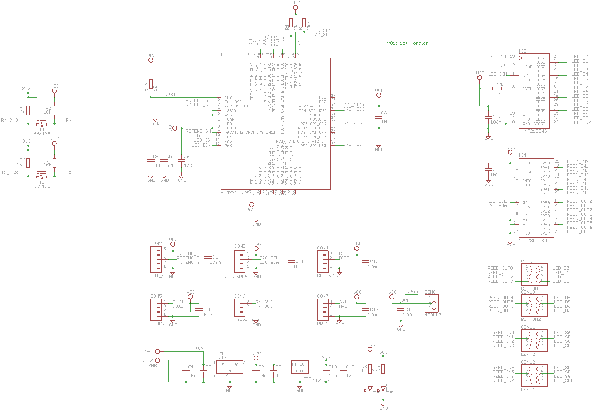
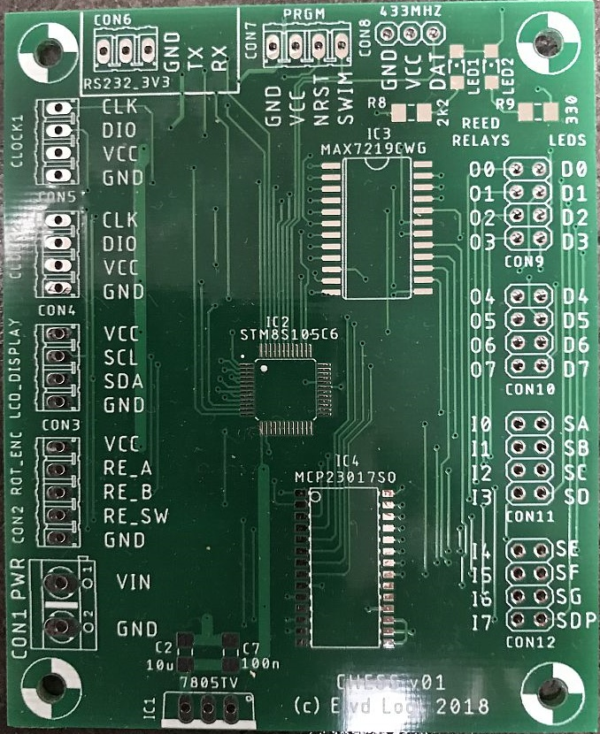

CHESS_STM8S105
==========

The purpose of this software is to create an interactive chess-board, that contains LEDs and reed-relays for every
field. An STM8S105 with a dedicated chess-board handles all logic. Via the UART, a move can be entered.

Software Development Environment
-----------
- Cosmic STM8 compiler. A license can be obtained free of charge from Cosmic-software.com. Install this first.
- ST Visual Develop (STVD). This can be obtained free of charge from st.com
- A coloured ST-Link V2 USB adapter (which are very cheap to find on ebay)

In order to program this thing, you can't have a code-size limit of 8 Kbytes, so IAR will not do the job. Fortunately, the Cosmic STM8 development environment (IdeaSTM8) has been made available free-of-charge. Just register and download and you have 
a development environment that nicely supports this device.

Quick start
-----------
To be defined.

Introduction
--------------
To be defined.

PCB Hardware
----------
Here's schematics version 01 of the PCB Hardware.

 
*Eagle schematics v01 of the Chess board*

 
*PCB version 01 (made by allpcb.com)*

